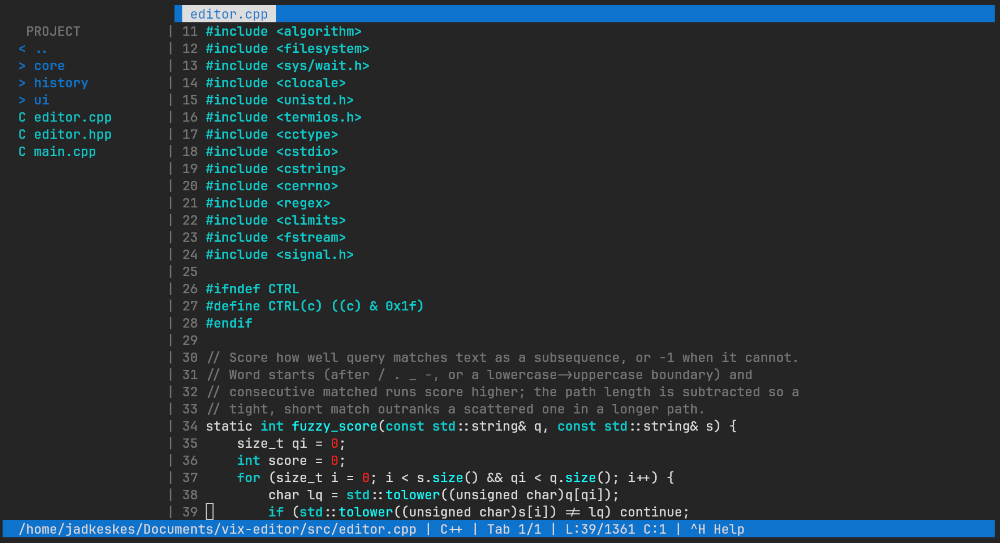
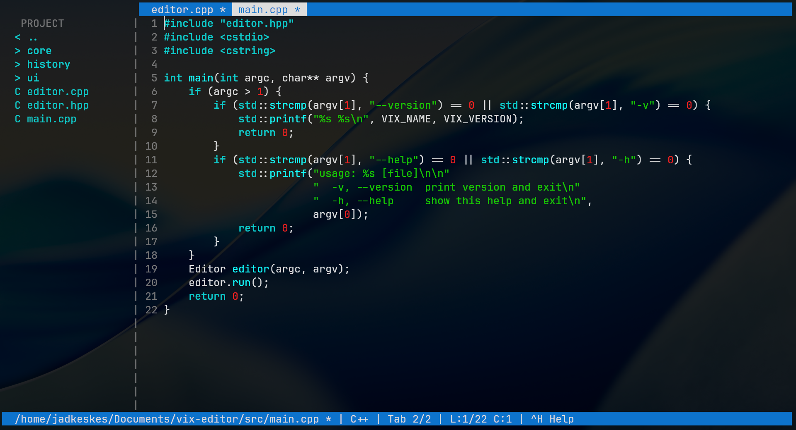

# ✿ Vix Ultimate — The Editor That's Lowkey Obsessed With You

Hey. You just opened a terminal and something *vibed*.

Vix is a **modeless** terminal text editor — like **nano** or **Emacs**, you just start typing. No modes, no `:wq!`, no muscle-memory roulette. It's a C++ editor with a tabbed buffer, a file-explorer sidebar, live search, syntax highlighting, and an undo/redo stack that behaves itself. It even compiles and runs your code so you don't have to lift a finger (okay, maybe one finger. Ctrl+R).

---

## Screenshots





---

## Release 1.0.4

Latest release: **[1.0.4](https://github.com/Jadkes/vix-editor/releases/tag/1.0.4)** — prebuilt **x86_64 Linux** binary.

What's new in 1.0.4:

- **Word wrap** — long lines wrap at word boundaries (toggle in `F2` Settings)
- **System clipboard** — `Ctrl+K` / `Ctrl+C` / `Ctrl+V` talk to the OS clipboard
  (via `wl-copy`/`wl-paste` on Wayland, `xclip`/`xsel` on X11), falling back to
  vix's internal clipboard when no tool is available
- **Replace single match** — during search, `Ctrl+D` replaces only the
  highlighted match instead of every occurrence
- **Session resume** — `vix --resume` reopens the tabs and directory from your
  last session (saved to `~/.config/vix/session.json` on quit)
- Multi-line paste is a single undoable command

### Install the binary (no build required)

```bash
curl -L -o vix-1.0.4-linux-x86_64.tar.gz \
  https://github.com/Jadkes/vix-editor/releases/download/1.0.4/vix-1.0.4-linux-x86_64.tar.gz
tar xzf vix-1.0.4-linux-x86_64.tar.gz
sudo install -m755 vix-1.0.4-linux-x86_64/vix /usr/local/bin/
vix --version   # → vix 1.0.4
```

---

## Requirements

- C++20 compiler (GCC or Clang)
- CMake ≥ 3.20
- Ninja
- ncursesw (wide-char ncurses; plain ncurses is used as a fallback)

## Build

```bash
cmake --preset default      # Release build into build/
cmake --build --preset default
```

```bash
cmake --preset debug        # Debug build into build-debug/
cmake --build --preset debug
```

## Tests

`ctest` is the single entry point for the whole suite. Build first, then run:

```bash
cmake --build build
ctest --test-dir build --output-on-failure
```

The suite has three test groups:

- **BufferTest** — line editing, bounds checks, and byte-for-byte save round-trips
  (LF, CRLF, no trailing newline)
- **HistoryTest** — undo/redo, redo invalidation, bounded stack trimming,
  single- and multi-line paste round-trips
- **PtySmoke** — drives the real `vix` binary through a pty: open/edit/save,
  the `^H` help window, the unsaved-changes prompt, CRLF preservation,
  save-as on untitled buffers, word-wrap rendering, and `--resume`

Unit tests compile only the core sources (no ncurses dependency); the pty test
needs `python3`. Disable tests with `-DBUILD_TESTING=OFF` if you don't want the
GoogleTest dependency at configure time.

## Install

```bash
cmake --install build --prefix ~/.local
```

Then run `vix` from anywhere. Open a file with `vix file.cpp` or start blank with `vix`.

## Keyboard

| Keybind | What it does |
| :--- | :--- |
| **`Ctrl + S`** | Save (prompts for a name on new files) |
| **`Ctrl + Q`** | Quit |
| **`Ctrl + H`** | Help window |
| **`F2`** | Settings panel (themes, tab width, autosave, etc.) |
| **`Ctrl + R`** | Compile & run the current file |
| **`Ctrl + F`** | Live search |
| **`F3`** / **`Shift+F3`** | Next / previous match |
| **`Ctrl + D`** | Replace all (outside search) / replace the highlighted match (in search) |
| **`Ctrl + P`** | Fuzzy file finder (type `mcp` to find `main.cpp`) |
| **`Ctrl + G`** | Go to line |
| **`Ctrl + Z`** / **`Ctrl + Y`** | Undo / redo |
| **`Ctrl + N`** | New tab |
| **`F5`** / **`Shift+Tab`** | Next / previous tab |
| **`Ctrl + \`** | Close tab |
| **`Ctrl + K` / `Ctrl + C` / `Ctrl + V`** | Cut / copy / paste (system clipboard) |

### Search flags (while searching)

| Key | Flag |
| :--- | :--- |
| **`Ctrl + R`** | Toggle regex |
| **`Ctrl + C`** | Toggle case sensitivity |
| **`Ctrl + W`** | Toggle whole-word match |

## Sidebar

| Keybind | Action |
| :--- | :--- |
| **`Ctrl + T`** | Toggle sidebar |
| **`Ctrl + W`** | Swap focus between editor and sidebar |
| **`Enter`** | Open the selected file or enter a folder |
| **`a`** | New file |
| **`d`** | Delete file / folder |

## Languages

Syntax highlighting, bracket matching, and (where a compiler exists) `Ctrl+R` support:

| Language | Extensions | Runner |
| :--- | :--- | :--- |
| **C++** | `.cpp`, `.hpp`, `.cc`, `.hh`, `.cxx`, `.hxx` | `g++` |
| **C** | `.c`, `.h` | `gcc` |
| **Python** | `.py` | `python3` |
| **JavaScript** | `.js`, `.mjs`, `.jsx` | `node` |
| **Rust** | `.rs` | `rustc` |
| **Go** | `.go` | `go run` |
| **Shell** | `.sh`, `.bash` | `bash` |
| **HTML / CSS / JSON / YAML** | — | highlighting only |

## Configuration

Settings live in `~/.config/vix/settings.json` and are written when you change them in the `F2` panel:

- Tab width
- Auto-save interval (seconds, `0` = off)
- Line numbers
- Auto-indent
- Theme (Monokai, Dracula, Nord, Solarized Light)
- Default language for new files
- Word wrap

When you quit, vix also writes `~/.config/vix/session.json` (the open tabs and
directory); start it with `vix --resume` to pick back up where you left off.
